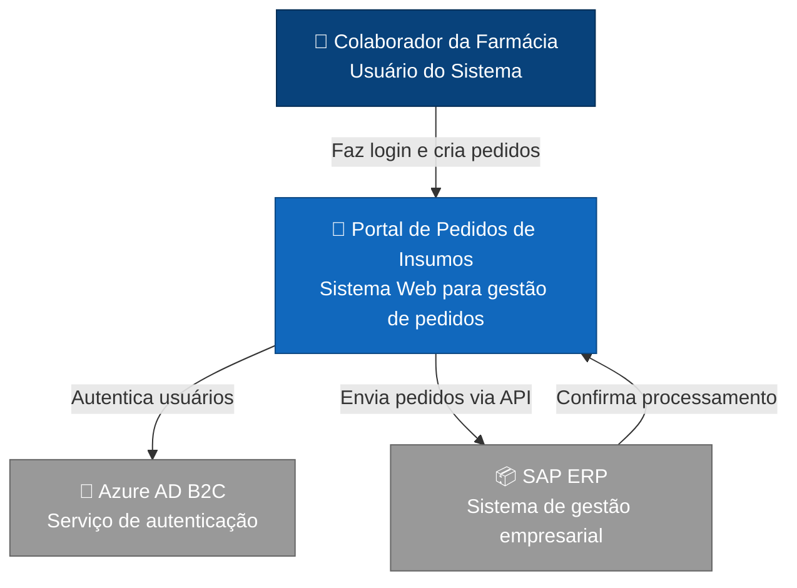
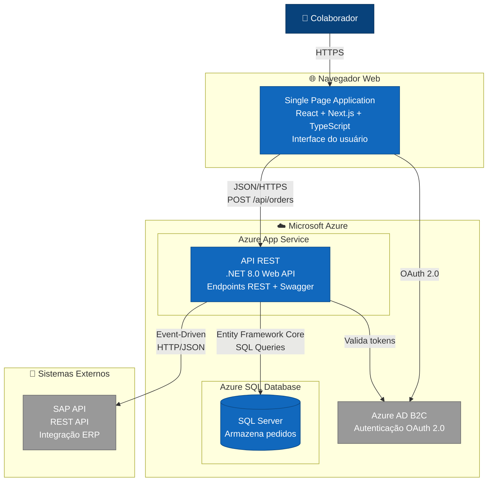
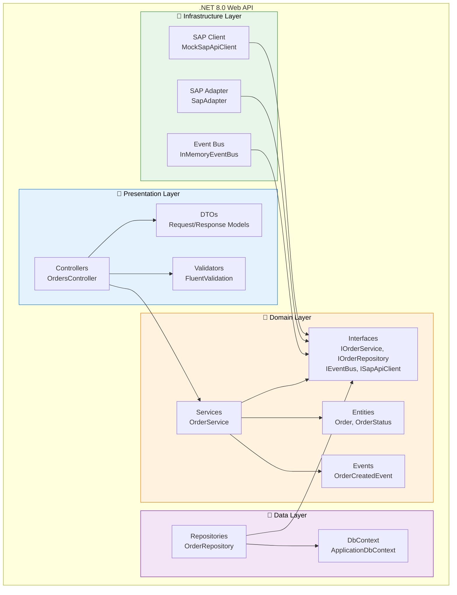
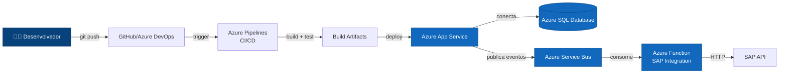

# Diagrama C4 - Portal de Pedidos de Insumos

## Nível 1: Diagrama de Contexto

### Descrição

**Portal de Pedidos de Insumos**: Sistema web corporativo que permite colaboradores de farmácias criarem pedidos de insumos. O sistema autentica usuários via Azure AD B2C e integra com SAP ERP para processamento dos pedidos.

**Usuários**: Colaboradores das farmácias (gerentes, farmacêuticos, assistentes) que precisam solicitar insumos para suas filiais.

**Sistemas Externos**:
- **Azure AD B2C**: Gerencia autenticação e autorização de usuários
- **SAP ERP**: Processa e gerencia pedidos de insumos no sistema corporativo

---

## Nível 2: Diagrama de Container

### Descrição dos Containers

#### 1. Single Page Application (Frontend)
- **Tecnologia**: React 18+ com Next.js 14+ e TypeScript
- **Responsabilidade**: Interface do usuário, formulários, validação client-side
- **Comunicação**: Consome API REST via HTTPS/JSON

#### 2. API REST (Backend)
- **Tecnologia**: .NET 8.0 (C#) com ASP.NET Core Web API
- **Responsabilidade**: 
  - Lógica de negócio
  - Validação de dados (FluentValidation)
  - Orquestração de eventos
  - Integração com SAP
- **Arquitetura**: Presentation-Domain-Data Layering
- **Comunicação**: 
  - Recebe requisições HTTP do frontend
  - Persiste dados no SQL Server
  - Publica eventos para integração SAP
  - Valida tokens JWT do Azure AD B2C

#### 3. SQL Server Database
- **Tecnologia**: Azure SQL Database (simulado com SQLite no MVP)
- **Responsabilidade**: Persistência de pedidos, histórico, status
- **Acesso**: Via Entity Framework Core

#### 4. Azure AD B2C
- **Tecnologia**: Serviço gerenciado Microsoft
- **Responsabilidade**: Autenticação e autorização de usuários
- **Protocolo**: OAuth 2.0 / OpenID Connect
- **Status MVP**: Simulado (não implementado)

#### 5. SAP API
- **Tecnologia**: REST API (sistema externo)
- **Responsabilidade**: Processar pedidos no ERP corporativo
- **Status MVP**: Mock/Simulado

---

## Arquitetura Interna da API (.NET)

### Camadas e Responsabilidades

#### Presentation Layer
- **Controllers**: Recebem requisições HTTP, delegam para services
- **DTOs**: Modelos de transferência de dados (Request/Response)
- **Validators**: Validação de entrada com FluentValidation

#### Domain Layer (Núcleo)
- **Services**: Lógica de negócio, orquestração
- **Entities**: Modelos de domínio (Order, OrderStatus)
- **Events**: Eventos de domínio (OrderCreatedEvent)
- **Interfaces**: Contratos que definem dependências

#### Data Layer
- **Repositories**: Implementação de acesso a dados
- **DbContext**: Contexto do Entity Framework Core

#### Infrastructure Layer
- **Event Bus**: Implementação de mensageria (in-memory para MVP)
- **SAP Adapter**: Adaptador para integração externa
- **SAP Client**: Cliente HTTP mock para simular SAP

### Princípios Aplicados

✅ **Dependency Inversion**: Domain não depende de Infrastructure/Data  
✅ **Single Responsibility**: Cada camada tem responsabilidade única  
✅ **Open/Closed**: Extensível via interfaces  
✅ **Interface Segregation**: Interfaces específicas e coesas  
✅ **Liskov Substitution**: Implementações substituíveis via DI

---

## Fluxo de Deploy (Futuro - Produção)

### Estratégia de Deploy

**MVP (Atual)**:
- Deploy manual ou via Visual Studio
- SQLite local
- Event bus in-memory

**Produção (Futuro)**:
- CI/CD com Azure Pipelines
- Azure App Service com auto-scaling
- Azure SQL Database
- Azure Service Bus para eventos
- Azure Functions para integração SAP
- Application Insights para monitoramento

---

## Decisões Arquiteturais

Para detalhes completos sobre decisões técnicas, consulte [ADRs.md](./ADRs.md):

- **ADR-001**: Azure App Service escolhido por simplicidade e custo-efetividade
- **ADR-002**: Event Bus in-memory para MVP, migração futura para Service Bus
- **ADR-003**: SQL Server por alinhamento com ecossistema Azure e contexto empresarial
