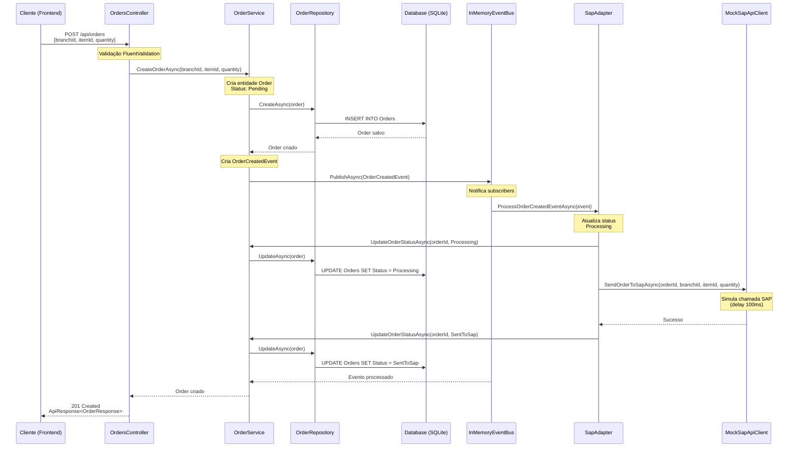
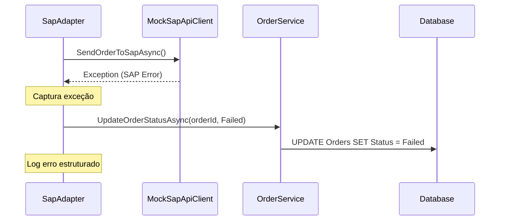

# Diagrama de Sequência - Fluxo de Criação de Pedido

## Fluxo Completo: POST /api/orders

## Descrição do Fluxo

### 1. Requisição HTTP
O cliente (frontend React) envia uma requisição POST para `/api/orders` com os dados do pedido.

### 2. Validação
O `OrdersController` recebe a requisição e o FluentValidation valida automaticamente:
- `branchId` não vazio e máximo 50 caracteres
- `itemId` não vazio e máximo 50 caracteres
- `quantity` maior que zero

### 3. Criação do Pedido
O `OrderService` cria uma nova entidade `Order` com:
- ID único (Guid)
- Status inicial: `Pending`
- Data de criação: `DateTime.UtcNow`

### 4. Persistência
O `OrderRepository` salva o pedido no banco de dados SQLite através do Entity Framework Core.

### 5. Publicação de Evento
O `OrderService` publica um evento `OrderCreatedEvent` no `InMemoryEventBus` contendo:
- OrderId
- BranchId
- ItemId
- Quantity
- CreatedAt

### 6. Processamento Assíncrono
O `InMemoryEventBus` notifica todos os subscribers registrados. O `SapAdapter` é acionado automaticamente.

### 7. Integração SAP (Mock)
O `SapAdapter`:
1. Atualiza o status do pedido para `Processing`
2. Chama o `MockSapApiClient` para simular a integração com SAP
3. Se sucesso: atualiza status para `SentToSap`
4. Se erro: atualiza status para `Failed`

### 8. Resposta
O controller retorna uma resposta 201 Created com os dados do pedido criado.

## Tratamento de Erros

## Componentes e Responsabilidades

### Presentation Layer
- **OrdersController**: Recebe requisições HTTP, valida entrada, retorna respostas

### Domain Layer
- **OrderService**: Lógica de negócio, orquestração do fluxo
- **Order (Entity)**: Modelo de domínio
- **OrderCreatedEvent**: Evento de domínio
- **Interfaces**: Contratos (IOrderService, IOrderRepository, IEventBus, ISapApiClient)

### Data Layer
- **OrderRepository**: Acesso a dados, operações CRUD
- **ApplicationDbContext**: Contexto do Entity Framework Core

### Infrastructure Layer
- **InMemoryEventBus**: Implementação de event bus em memória
- **SapAdapter**: Adaptador para integração SAP
- **MockSapApiClient**: Cliente mock para simular API SAP

## Event-Driven Architecture

O projeto utiliza arquitetura orientada a eventos para desacoplar a criação do pedido da integração SAP:

**Vantagens:**
- Desacoplamento entre componentes
- Processamento assíncrono
- Facilita adição de novos subscribers
- Preparado para migração para Azure Service Bus

**Implementação Atual (MVP):**
- Event bus em memória (não persistente)
- Processamento síncrono dentro do mesmo processo
- Ideal para desenvolvimento e testes

**Evolução Futura (Produção):**
- Azure Service Bus para persistência de eventos
- Processamento distribuído
- Retry policies e dead-letter queues
